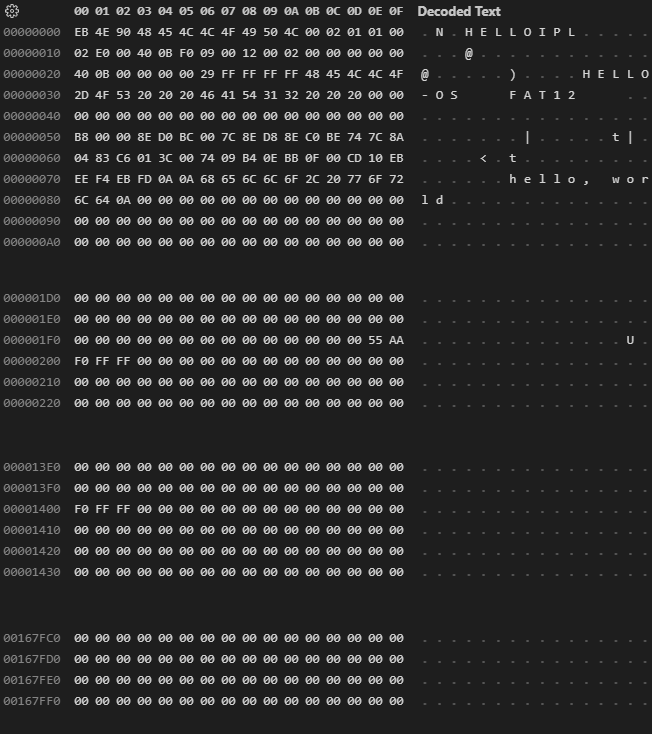

# day 01 - PC 구조부터 Assembly 입문까지

## Binary

binary로 컴퓨터, CPU의 모든것이 작동한다.
컴퓨터, CPU는 전기신호(ON/OFF, 1/0)를 다른 회로와 주고 받는 기능으로 동작한다.
결국 CPU 명령과 데이터 모두 binary 이고, 모든 프로그램 코드는 최종적으로 0과 1, 기계어가 된다.

## Assembly

assembler는 저자가 개발한 nask를 사용한다.

```
DB   : data byte - 1byte 쓰기
DW   : data word - 2byte
DD   : data double word - 4byte
RESB : reserve byte - n 만큼 띄운다. (nask에서는 0x00으로 채운다.)
;    : comments
```

## IPL (Initial Program Loader)

초기 프로그램 읽기 장치  
부트섹터 512byte는 OS를 쓰기에는 부족하기 때문에 OS 본체를 읽어 들이는 프로그램을 써둔다. 그래서 부트섹터를 IPL 이라고 부르기도 한다.

## hello, world

hello, world 를 출력하는 OS?

기능(기본설정, 문자열 출력)이 적기 때문에 부트섹터 안에 작성 가능하다.
다음의 binary file과 assembly를 compile 한 결과는 같다.



```assembly

; 이하는 표준적인 FAT12 포맷 플로피 디스크를 위한 기술

	DB		0xeb, 0x4e, 0x90
	DB		"HELLOIPL"	; boot sector의 이름 (8byte)
	DW		512			; 1섹터의 크기(512)
	DB		1			; 클러스터의 크기(1섹터로 해야 함)
	DW		1			; FAT가 어디에서 시작될까(보통은 1섹터째부터)
	DB		2			; FAT의 개수(2로 해야 함)
	DW		224			; 루트 디렉토리 영역의 크기(보통은 224엔트리로 한다)
	DW		2880		; 드라이브 크기(2880섹터 해야 함)(1440kb / 512byte)
	DB		0xf0		; 미디어 타입(0xf0해야 함)
	DW		9			; FAT영역 길이(9섹터로 해야 함)
	DW		18			; 1트럭에 몇개의 섹터가 있을까(18로 해야 함)
	DW		2			; 헤드 수(2로 해야 함)
	DD		0			; 파티션을 사용하지 않기 때문에 여기는 반드시 0
	DD		2880		; 드라이브 크기를 한번 더 write
	DB		0,0,0x29	; 잘 모르지만 이 값으로 해 두면 좋은 것 같다
	DD		0xffffffff	; 아마, 볼륨 시리얼 번호
	DB		"HELLO-OS   "	; 디스크 이름(11바이트)
	DB		"FAT12   "	; 포맷 이름(8바이트)
	RESB	18			; 우선 18바이트를 비어둔다

; 프로그램 본체

	DB		0xb8, 0x00, 0x00, 0x8e, 0xd0, 0xbc, 0x00, 0x7c
	DB		0x8e, 0xd8, 0x8e, 0xc0, 0xbe, 0x74, 0x7c, 0x8a
	DB		0x04, 0x83, 0xc6, 0x01, 0x3c, 0x00, 0x74, 0x09
	DB		0xb4, 0x0e, 0xbb, 0x0f, 0x00, 0xcd, 0x10, 0xeb
	DB		0xee, 0xf4, 0xeb, 0xfd

; 메세지 부분

	DB		0x0a, 0x0a		; 개행을 2개
	DB		"hello, world"
	DB		0x0a			; 개행
	DB		0

	RESB	0x1fe-$			; 0 x001fe까지를 0x00로 채우는 명령
							; 510(1fe) - 선두로 부터 byte 수($)

	DB		0x55, 0xaa		; 부팅가능 여부 - 부트섹터의 마지막 2byte '55 AA'

; 이하는 boot sector이외의 부분을 기술

	DB		0xf0, 0xff, 0xff, 0x00, 0x00, 0x00, 0x00, 0x00
	RESB	4600
	DB		0xf0, 0xff, 0xff, 0x00, 0x00, 0x00, 0x00, 0x00
	RESB	1469432
```
